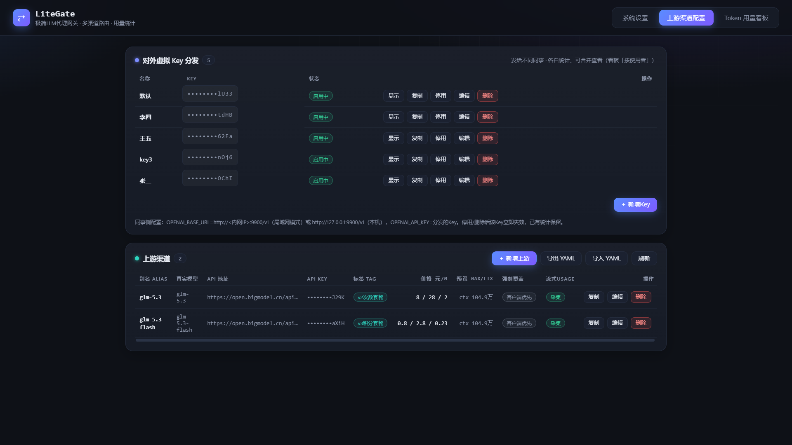
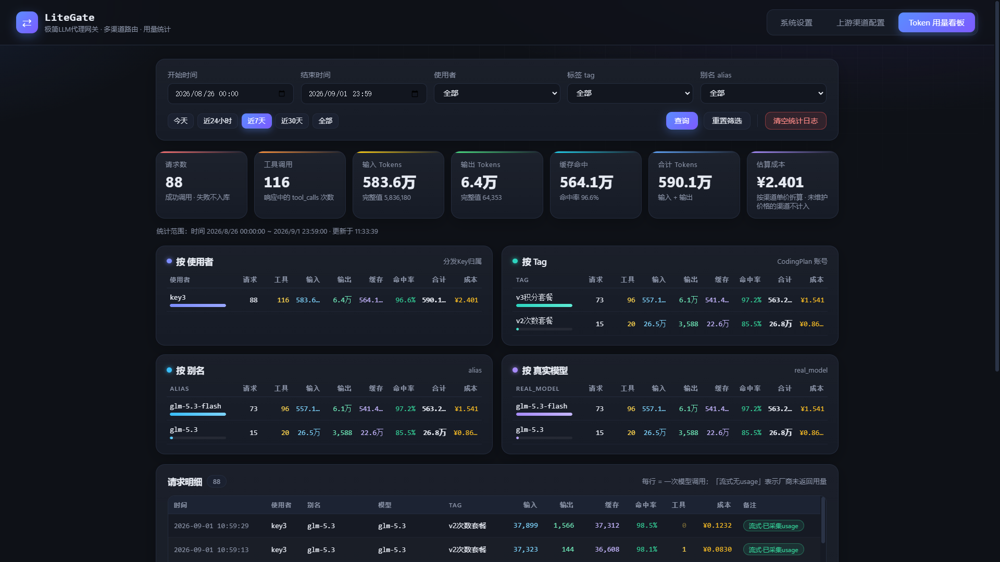
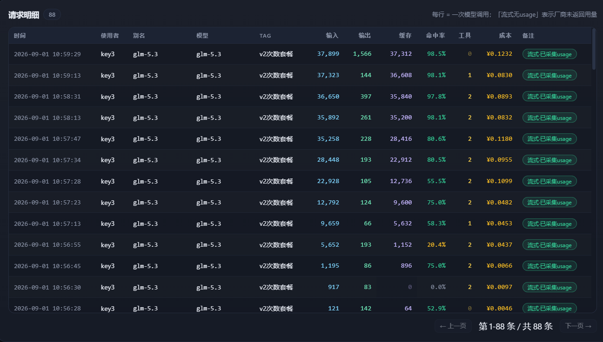
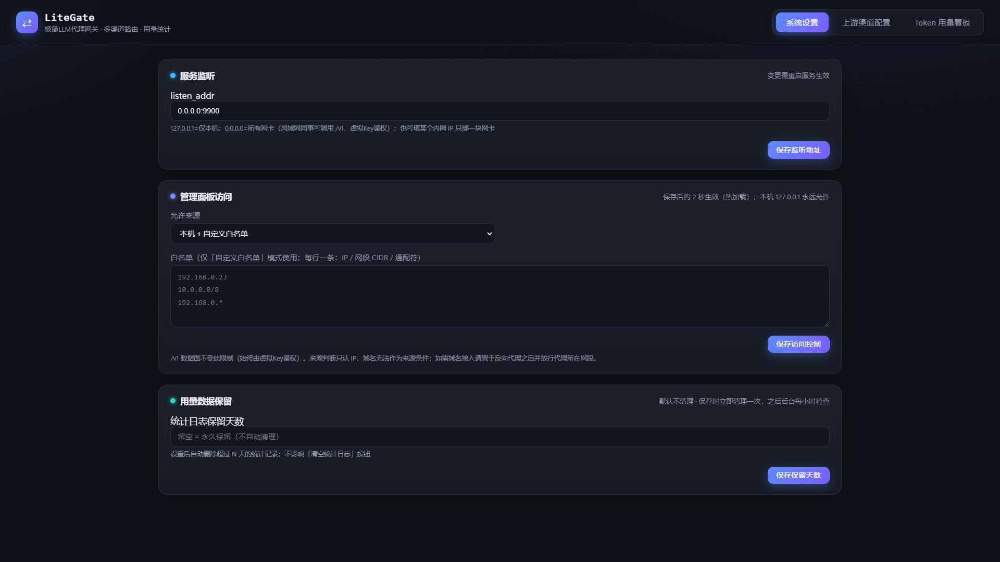

# LiteGate · 极简LLM代理网关

[](LICENSE)

⚡ 一键启动 · 🪶 纯透传不消耗额外 token · 📊 用量纯本地记录 · 🗂️ 多渠道多 Key 统一管理

面向个人/小团队本地使用的 LLM 代理网关：把多家厂商 **CodingPlan 订阅密钥** 统一收敛到
一个 OpenAI 兼容入口，对外分发若干把**虚拟 API Key**（可发给不同同事，按 Key 分别统计、
也可合并看总计）；内置 Web 面板管理上游渠道与查看 Token 用量。**首次启动即局域网模式**：
监听 `0.0.0.0`，管理面板默认允许「本机+局域网」访问（可在面板「系统设置」改为
仅本机 / 白名单 / 不限制；本机 127.0.0.1 任何模式下都放行）；`/v1` 数据面始终由虚拟Key鉴权。

```
编码工具(DSH/Claude Code/Aider…)
        │  OPENAI_BASE_URL=http://127.0.0.1:8000/v1
        │  OPENAI_API_KEY=<虚拟Key>
        ▼
┌─────────────────────────────┐      ┌──────────────────────────┐
│ LiteGate (FastAPI 单进程)  │ HTTP │ 上游A: xxx CodingPlan    │
│  /v1/chat/completions       │─────▶│ 上游B: yyy CodingPlan    │
│  别名路由 / 参数合并         │      │ 上游C: zzz 网关/中转     │
│  SSE 直通 / SQLite 统计     │      └──────────────────────────┘
│  Web面板 :8000/             │
└─────────────────────────────┘
```

## 核心亮点

- ⚡ **一键启动，开箱即用**：Windows 双击 `start.bat`、Linux/macOS `bash start.sh`，
  自动创建虚拟环境 → 安装依赖 → 构建校验 → 拉起服务，二次启动秒级就绪，全程无需手动配置；
- 🪶 **纯透传，不消耗额外 token**：请求与响应原样转发、SSE 字节级直通，网关不发起任何
  LLM 调用、不改写消息内容——除了你本来就要花的那份，**一分额外 token 都不多花**；
- 📊 **纯本地记录**：每笔请求的模型、使用者、输入/输出/缓存 token 全部落到本地单文件
  SQLite，数据不出本机、不依赖任何云端统计服务，SQL 随查随用；
- 🗂️ **统一管理**：多家厂商渠道与多把对外虚拟 Key 收敛到一个 Web 面板，增删改查、
  YAML 导入导出、按使用者分别或合并看用量，一个页面管完。

## 界面预览

| 上游渠道配置 | Token 用量看板（含成本估算） |
| --- | --- |
|  |  |
| **用量明细** | **系统设置（含用量保留天数）** |
|  |  |

## 特性一览

- OpenAI 兼容接口：`POST /v1/chat/completions` + `GET /v1/models`（实时返回已配置的模型列表；明确排除 embedding 等其他接口）
- 鉴权：多把`api_keys`分发（每把有名称与启停开关），Bearer 校验不匹配返回 401；
  每次调用统计归属到对应使用者（同事），看板支持「按使用者」分别或合并查看
- 用量计数：请求数与工具调用次数(tool_calls)一并入表聚合
- 模型别名路由：同一真实模型可配多条记录（不同 alias / key / tag），多账号用量隔离
- 参数合并：每条渠道可预设 `max_tokens` / `max_context_tokens`，
  支持「强制覆盖客户端参数」开关
- 流式：SSE 原样字节级透传；按约定**不解析 SSE 提取 usage**，token 记 0 并打标记
- 错误：上游 4xx/5xx 报文原样透传，不做包装、不做重试降级
- 存储：渠道配置 → 本地 YAML（热加载）；用量统计 → 单文件 SQLite，
  支持按保留天数自动清理过期记录（默认不清理）
- Web 面板：渠道增删改查 + YAML 导入导出；看板支持筛选、三维聚合、成本估算、清空日志与按保留天数自动清理

## 快速开始

### 一键启动（推荐）

| 平台 | 方式 |
| --- | --- |
| Windows | 双击 `start.bat`（或命令行运行 `start.bat`） |
| Linux / macOS | `bash start.sh`（或首次 `chmod +x start.sh` 后 `./start.sh`） |

脚本自动完成：创建 `.venv` 虚拟环境并安装依赖 → 前端构建校验（JS 语法检查 +
生成 `.build-info.json`）→ 拉起服务。二次启动复用环境，秒级就绪。
关闭窗口 / `Ctrl+C` 即停止服务。常用参数：`--open`（自动打开面板）、
`--no-venv`（不建虚拟环境）、`--listen 127.0.0.1:8000`（临时改监听）。

**首次启动即局域网模式**：监听 `0.0.0.0:8000`，管理面板允许「本机 + 局域网」访问。
你本机打开 <http://127.0.0.1:8000/>；局域网同事只能调用 `/v1` 接口（虚拟Key鉴权）。
安全要求高的环境，请在面板「系统设置 → 管理面板访问」改为「仅本机」，
或把「服务监听」改回 `127.0.0.1:8000` 后重启。

### 初始配置

首次运行会自动生成 `config.yaml`（含一把随机虚拟 Key）。进入面板后：

1. 「上游渠道配置 → 对外虚拟 Key 分发」：新增/复制 Key 分发给同事（按使用者分别统计）；
2. 「新增上游」填写：别名（给工具用的名字）、真实模型、`api_base`（填到 `/v1` 为止）、
   `api_key`、标签，需要的话再配预设参数与上下文长度；
3. 编码工具侧配置：

```bash
export OPENAI_BASE_URL=http://127.0.0.1:8000/v1
export OPENAI_API_KEY=<面板中的虚拟Key>
# 工具里 model 直接填别名，例如 claude-sonnet-plan-a
```

直接调用示例：

```bash
curl http://127.0.0.1:8000/v1/chat/completions \
  -H "Authorization: Bearer sk-virtual-xxxx" \
  -H "Content-Type: application/json" \
  -d '{"model":"claude-sonnet-plan-a","messages":[{"role":"user","content":"hi"}],"stream":false}'
```

## CLI 参数

| 参数 | 默认 | 说明 |
| --- | --- | --- |
| `--config` | `./config.yaml` | 渠道配置文件路径 |
| `--db` | `./usage.db` | SQLite 统计库路径 |
| `--listen` | 配置文件 `listen_addr` | 监听地址（一次性生效，不回写文件）；如 `0.0.0.0:8000` 开启局域网模式 |

## 配置文件示例

```yaml
listen_addr: 127.0.0.1:8000
retention_days: 90               # 统计日志保留天数；留空/删除此行 = 不自动清理
api_keys:
  - name: 默认            # 自己用
    key: sk-virtual-Xw2f...
    enabled: true
  - name: 同事B           # 发给同事的Key
    key: sk-virtual-A8xq...
    enabled: true
upstreams:
  - id: a1b2c3                      # 自动生成，无需手填
    alias: claude-sonnet-plan-a     # 工具侧 model 名（唯一）
    real_model: claude-sonnet-4-5   # 服务商真实模型名
    api_base: https://api.example.com/v1
    api_key: sk-real-key-aaaa       # 留空则不携带 Authorization 头
    tag: plan-account-a             # 仅用于统计区分账号，不参与转发
    max_tokens: 8192                # 最大输出预设
    max_context_tokens: 128000      # 上下文窗口上限预设
    force_override_client_params: false
  - alias: claude-sonnet-plan-b     # 同一真实模型的第二个账号
    real_model: claude-sonnet-4-5
    api_base: https://api.example.com/v1
    api_key: sk-real-key-bbbb
    tag: plan-account-b
    max_tokens: null
    max_context_tokens: null
    force_override_client_params: true
```

Web 面板改动会原子写回此文件并即时生效；用编辑器手工修改也一样会在约 2 秒内被
热加载（解析失败时保留旧配置继续服务，不中断请求）。

### 参数优先级规则

对 `max_tokens`、`max_context_tokens` 逐个字段判断：

| force_override_client_params | 客户端传了该参数 | 结果 |
| --- | --- | --- |
| ✅ true | 无论传没传 | 一律替换为网关预设 |
| ❌ false | 传了（非 null） | 客户端值胜出 |
| ❌ false | 没传 / null | 有预设 → 注入预设；无预设 → 原样透传 |

> 说明：预设值以**同名字段**合并进转发 JSON（如 `max_context_tokens` 就是顶层
> `"max_context_tokens"` 字段），适配 DeepSeek/Qwen/GLM 及各类中转的常见约定；
> 若个别厂商要求特定嵌套格式而不认识该字段，通常会忽略——届时可通过网关侧
> "留空"避免干扰。

### 流式与非流式的统计口径

- **非流式**：读取上游返回的 `usage.prompt_tokens / completion_tokens` 完整入库。
- **流式**：部分厂商 CodingPlan 的 SSE 不返回 usage。按约定不主动解析 SSE；
  但每条渠道可开启 `parse_stream_usage` —— 网关注入
  `stream_options: {"include_usage": true}` 并在字节直通的同时旁路扫描末片 usage，
  能拿到 输入/输出/缓存 三项真实值（厂商不支持该参数则仍记 0、标记「流式无usage」）。
- 仅成功响应入库；上游 4xx/5xx 原样透传给客户端，**不写库**，不污染统计。

### 成本估算口径

- 按渠道单价（元 / 百万 Tokens）折算：缓存命中的输入按缓存价计，其余输入按输入价计；
- **输入/输出哪项价格留空，该项按 0 元计入**（如只填输出价 → 成本=纯输出费用），
  需要准确总额请把输入、输出价格都填上；缓存价留空时缓存部分按输入价折算；
- 成本按**请求发生时点**的单价入库，之后改价不影响历史记录；
- 三项价格全未维护、或本次无 usage（流式未采集）时，该笔成本记 NULL，不计入合计。

## 存储层

### logs 表结构（SQLite，单文件）

| 列 | 类型 | 说明 |
| --- | --- | --- |
| create_time | REAL | 请求完成时间戳（Unix 秒） |
| alias | TEXT | 客户端使用的模型别名 |
| real_model | TEXT | 服务商真实模型名 |
| upstream_tag | TEXT | 上游自定义标签（区分 CodingPlan 账号） |
| client_name | TEXT | 命中的分发Key名称（使用者归属） |
| tool_calls | INTEGER | 本次响应中模型发起的工具调用次数 |
| prompt_tokens | INTEGER | 输入 tokens（流式恒为 0） |
| completion_tokens | INTEGER | 输出 tokens（流式恒为 0） |
| cached_tokens | INTEGER | 输入中命中上游缓存的 tokens（≤ prompt_tokens；取自 usage.prompt_tokens_details.cached_tokens，兼容 DeepSeek 的 prompt_cache_hit_tokens；未开启采集或厂商不支持时为 0） |
| is_stream | INTEGER | 1=流式请求（UI 标注“流式无usage”） |

### SQL 聚合查询示例

**1️⃣ 按上游 tag 分组统计 token**

```sql
SELECT upstream_tag                            AS tag,
       SUM(prompt_tokens)                      AS total_prompt,
       SUM(completion_tokens)                  AS total_completion,
       SUM(prompt_tokens + completion_tokens)  AS total_all
FROM logs
GROUP BY upstream_tag
ORDER BY total_all DESC;
```

**2️⃣ 按别名 alias 分组统计 token**

```sql
SELECT alias,
       SUM(prompt_tokens)                      AS total_prompt,
       SUM(completion_tokens)                  AS total_completion,
       SUM(prompt_tokens + completion_tokens)  AS total_all
FROM logs
GROUP BY alias
ORDER BY total_all DESC;
```

**3️⃣ 按真实模型 real_model 分组统计 token**

```sql
SELECT real_model,
       SUM(prompt_tokens)                      AS total_prompt,
       SUM(completion_tokens)                  AS total_completion,
       SUM(prompt_tokens + completion_tokens)  AS total_all
FROM logs
GROUP BY real_model
ORDER BY total_all DESC;
```

**附：带时间范围 / 维度过滤的变体**

```sql
-- 最近 7 天，按 tag 分组
SELECT upstream_tag AS tag,
       SUM(prompt_tokens)                     AS total_prompt,
       SUM(completion_tokens)                 AS total_completion,
       SUM(prompt_tokens + completion_tokens) AS total_all
FROM logs
WHERE create_time >= strftime('%s', 'now', '-7 days')
GROUP BY upstream_tag
ORDER BY total_all DESC;

-- 只看某个别名在指定时间段的每日趋势
SELECT date(create_time, 'unixepoch', 'localtime') AS day,
       SUM(prompt_tokens)                     AS prompt,
       SUM(completion_tokens)                 AS completion,
       SUM(prompt_tokens + completion_tokens) AS total
FROM logs
WHERE alias = 'claude-sonnet-plan-a'
  AND create_time BETWEEN strftime('%s', '2025-06-01') AND strftime('%s', '2025-07-01')
GROUP BY day
ORDER BY day;

-- 每轮请求的缓存命中率（明细，命中率 = cached_tokens / prompt_tokens）
SELECT datetime(create_time, 'unixepoch', 'localtime') AS time,
       alias,
       prompt_tokens,
       cached_tokens,
       ROUND(cached_tokens * 100.0 / NULLIF(prompt_tokens, 0), 1) AS hit_rate_pct
FROM logs
WHERE prompt_tokens > 0
ORDER BY create_time DESC;

-- 按 tag 分组的整体命中率（用 SUM 相除，而非命中率平均值）
SELECT upstream_tag                          AS tag,
       SUM(prompt_tokens)                    AS total_prompt,
       SUM(cached_tokens)                    AS total_cached,
       ROUND(SUM(cached_tokens) * 100.0
             / NULLIF(SUM(prompt_tokens), 0), 1) AS hit_rate_pct
FROM logs
GROUP BY upstream_tag
ORDER BY hit_rate_pct DESC;

-- 按使用者（同事）分组：请求数 / 工具调用 / Token 与缓存命中率
SELECT client_name                       AS 使用者,
       COUNT(*)                          AS 请求数,
       SUM(tool_calls)                   AS 工具调用次数,
       SUM(prompt_tokens)                AS 输入,
       SUM(completion_tokens)            AS 输出,
       SUM(cached_tokens)                AS 其中缓存,
       ROUND(SUM(cached_tokens)*100.0 / NULLIF(SUM(prompt_tokens),0), 1) AS 命中率pct,
       SUM(prompt_tokens + completion_tokens) AS 合计tokens
FROM logs
GROUP BY client_name
ORDER BY 合计tokens DESC;

-- 平均每次请求消耗
SELECT COUNT(*)                                  AS requests,
       AVG(prompt_tokens)                        AS avg_prompt,
       AVG(completion_tokens)                    AS avg_completion
FROM logs;
```

直接打开命令行查询：`sqlite3 usage.db "<上面任意一条 SQL>"`。

### 用量日志自动清理（可选）

配置 `retention_days`（面板「系统设置 → 用量数据保留」可改，默认不清理）：
设置后**超过 N 天的统计记录会被自动删除**——保存设置时立即清理一次，
之后网关后台每小时检查一次；留空 = 永久保留。

## Web 面板接口（本地自用，不做登录鉴权）

| 方法 | 路径 | 说明 |
| --- | --- | --- |
| GET | `/` | 面板页面 |
| GET/PUT | `/admin/config`, `/admin/settings` | 读取 / 更新全局设置 |
| GET/POST | `/admin/upstreams` | 列表 / 新增渠道 |
| GET/POST | `/admin/api_keys` | 分发Key列表 / 新增（值留空自动生成） |
| PUT/DELETE | `/admin/api_keys/{id}` | 编辑(改名/停用) / 删除Key |
| PUT/DELETE | `/admin/upstreams/{id}` | 编辑 / 删除渠道 |
| GET | `/admin/export` | 导出当前配置为 YAML |
| POST | `/admin/import` `{"content": "..."}` | 导入 YAML（旧文件备份为 `.bak`） |
| GET | `/admin/stats/logs` | 明细（start/end/tag/alias/limit/offset） |
| GET | `/admin/stats/summary` | 三维聚合 + 总计（同筛选参数） |
| DELETE | `/admin/stats/logs` | 清空全部统计日志 |
| GET | `/admin/meta` | 筛选下拉候选值 |

## 安全边界（重要）

- 监听地址可自由配置（首次启动种子为 `0.0.0.0:8000`）；`0.0.0.0` 即局域网模式，供同事调用 `/v1`（虚拟Key鉴权）；
- **管理面（/、/admin、/static）访问来源由 `admin_access` 配置控制**：`local`=仅本机、`lan`=本机+私有网段（默认）、`allowlist`=本机+白名单（IP/CIDR/通配符）、`any`=不限制；由 `app/server.py` 的 `admin_access_guard` 中间件执行，随配置热加载，本机回环任何模式下都放行；
- 注意：不对公网开放，暴露端口前请确认所在网络可信，并保持系统防火墙开启；
- **跨站写请求防护（CSRF）**：管理面写接口（POST/PUT/DELETE）会校验 `Origin`/`Referer`
  与站点 Host 的一致性，不一致即 403——拦截局域网内其他机器浏览器中恶意网页发起的
  跨站写请求（无登录鉴权下的兜底防线）；命令行工具与面板同源请求不受影响；
- `/admin/*` 按“本地自用”设计**没有登录鉴权**——本机任何进程都能读写配置与统计数据；
- `api_key` 以明文存放在 YAML 中，请自行做好磁盘安全/备份（导出功能同样包含明文密钥）。

## 项目结构

```
LiteGate/
├── LICENSE                  # MIT 开源协议
├── start.bat              # Windows 一键启动（双击即可）
├── start.sh               # Linux/macOS 一键启动
├── main.py                # 启动入口（CLI 解析、横幅）
├── requirements.txt
├── app/
│   ├── config.py          # YAML 校验/原子落盘/mtime 热加载（含 admin_access）
│   ├── db.py              # SQLite 写入/筛选/聚合/清空
│   ├── gateway.py         # /v1/chat/completions + /v1/models：鉴权·路由·参数合并·SSE直通
│   ├── admin.py           # Web 管理 API
│   ├── server.py          # 应用装配（含管理面访问来源中间件）
│   └── static/            # 内置前端（原生 HTML/CSS/JS，无构建步骤）
├── scripts/
│   ├── start.py           # 跨平台启动编排（venv 自举/构建校验/拉起服务）
│   └── smoke_test.py      # 端到端冒烟测试（自带 mock 上游）
├── docs/                    # 界面截图
├── config.yaml            # 运行时生成（含真实密钥，勿提交）
└── usage.db               # 运行时生成
```

## 测试

```bash
python scripts/smoke_test.py
```

自动拉起 mock 上游 + 网关子进程，验证：鉴权 401、未知别名 400、别名路由与
model 替换、三种参数优先级、错误原样透传且不脏库、SSE 直通且记 0、外部改
YAML 热加载、导入导出往返、聚合计数、清空日志、保留天数自动清理 —— 共 16 组断言。

## 设计边界 · 欢迎二次开发 🛠️

LiteGate 刻意保持「极简」，以下功能**核心内置不做**（不做 ≠ 不能做）：

> 多租户 / 团队账号 / 配额限流 / 计费金额 / 告警 / 故障降级重试 / 负载均衡 /
> embedding / list-models / 内容过滤。网关不修改原始消息，仅做路由与参数合并。

**非常欢迎 Fork 与二次开发！** 下面是社区呼声较高的方向，附上推荐切入点：

| 方向 | 说明 | 建议切入点 |
| --- | --- | --- |
| 🔐 管理面板登录鉴权 | 为 `/admin/*` 与面板页面增加账号密码 / Token 登录（当前按本地自用设计，无鉴权） | `app/server.py` 的 `admin_access_guard` 中间件 |
| 🚦 Token 配额限制 | 按虚拟 Key 设置用量上限（次/日、token 总量），超额拒绝或告警 | `app/gateway.py` 鉴权处 + `app/db.py` 聚合查询 |
| 💰 计费金额估算 | 按渠道单价折算金额 | `app/db.py` 聚合 + 面板 `app/static/` |

核心仅 6 个 Python 模块 + 原生前端，无构建链、无框架绑定，二次开发上手成本极低。
欢迎提交 Issue / PR，或直接 Fork 按自己的需求魔改（MIT 允许一切，保留版权声明即可）。

## 开源协议

本项目基于 [MIT License](LICENSE) 开源——可自由使用、修改、商用与二次分发，
只需保留版权与许可声明。

如果 LiteGate 对你有帮助，欢迎点一个 ⭐ Star 支持一下！
